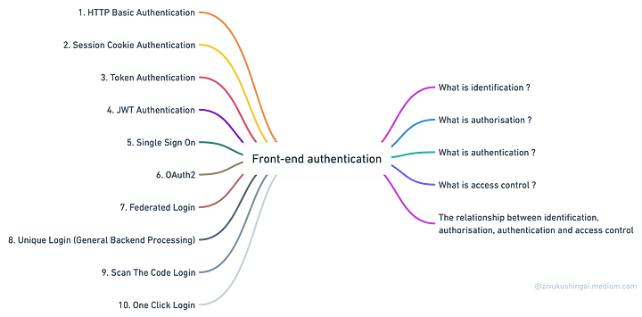
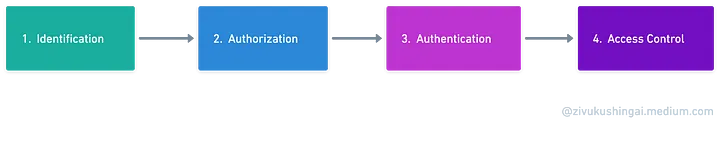
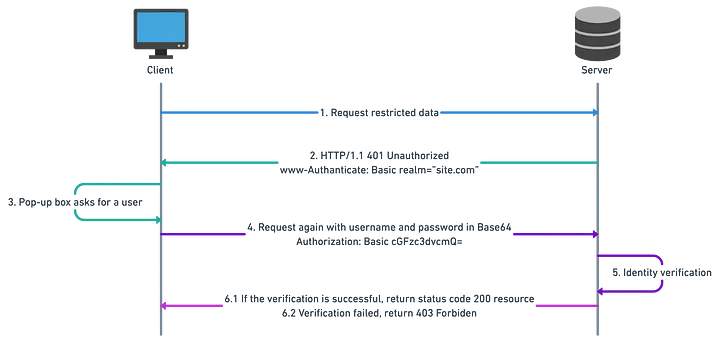
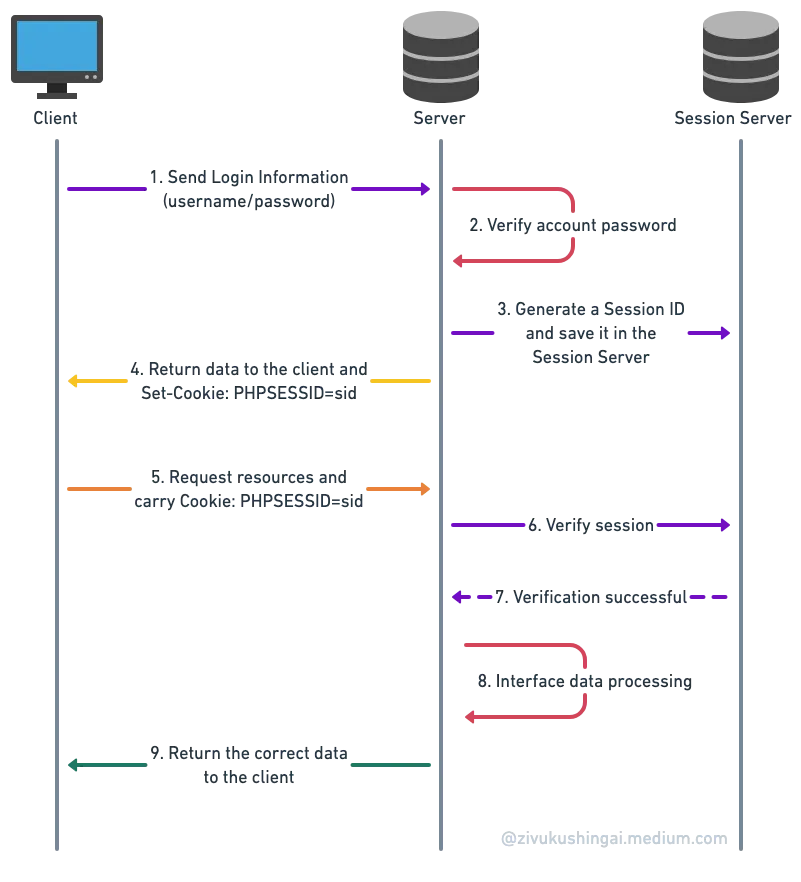
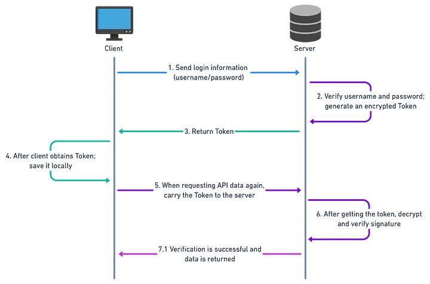

# What will you learn through this article?


Before introducing authentication methods, it is essential to understand the concepts of `identification`, `authorization`, authentication, access control, and their relationships. By understanding these fundamentals, you can build a solid foundation for comprehending the topic as a whole.

## What is identification?
**Identification is the process of verifying a person’s identity.** It involves providing information that can be used to uniquely identify a person, such as their `name`, `address`, or `date` of `birth`.
**In simpler terms, it means you need to prove that you are who you claim to be.**
Here are some common authentication techniques that are used to verify a person’s identity:

1. **Identification card:** An identification card is a physical document that contains a person’s unique identifying information.
2. **Username and password:** A username and password are a combination of characters that are used to log in to a computer system or website.
3. **User’s mobile phone:** A user’s mobile phone can be used to verify their identity by sending a `one-time password (OTP)` or by scanning a QR code.
4. **User’s email:** A user’s email address can be used to verify their identity by sending an OTP or by clicking on a link in an email.
5. **User’s biometric features:** Biometric features, such as fingerprints or facial scans, can be used to verify a person’s identity.

## What is authorization?
In the field of information security, **authorization refers to the process of granting users or services the right to access certain resources or perform certain actions.** This is done to ensure that only authorized users have access to sensitive data or systems.

In real-world scenarios, examples of authorization include:

1. **Bank cards issued by banks,** which allow users to withdraw money from ATMs or make purchases.
2. **Access cards are distributed by property management companies,** which allow residents to enter buildings or access certain areas.
3. **Keys are provided by landlords**, which allow tenants to enter their homes.

On the internet, examples of authorization mechanisms include:

- **Sessions:** A session is a temporary authenticated state that a user has with a website or application. Once a user has logged in, they are assigned a session ID, which is used to track their activity on the website or application.
- **Cookies:** Cookies are small text files that are stored on a user’s computer by a website or application. Cookies can be used to store session IDs, user preferences, or other information.
- **Authorization tokens:** Authorization tokens are a type of cryptographic token that is used to grant access to resources. Authorization tokens are typically issued by an authorization server and are used to authenticate users to a resource server.

`Authorization` is an important part of information security. By ensuring that only authorized users have access to sensitive data or systems, organizations can help to protect themselves from unauthorized access, data breaches, and other security incidents.


## What is authentication?
**Authentication is the process of verifying the identity of an entity and confirming the authenticity of the rights claimed by that entity.** It is a critical component of information security, as it helps to protect systems and data from unauthorized access.

**Authorization is the process of determining what permissions an authenticated entity has. It is closely related to authentication, but it is a separate process.**

In real-world scenarios, authentication can be seen in the use of access cards, bank cards, and passwords. When you swipe your access card at a door, the card reader verifies that the card is valid and that you are authorized to enter the door. When you enter your bank card PIN at an ATM, the ATM verifies that the PIN is correct and that you are authorized to withdraw money from your account.

On the internet, authentication is used to verify the identity of users and to protect their sessions. When you log in to a website, the website verifies your username and password to confirm that you are who you say you are. The website then creates a session for you, which is a temporary identifier that is used to track your activity on the website.

**Authentication is a crucial link between authorization and permission control. Authorization determines what permissions an authenticated entity has, and permission control enforces those permissions. Authentication provides the foundation for authorization and permission control, and it is essential for protecting systems and data from unauthorized access.**

## What is access control?
**Access control is the process of defining a list of permissible operations and determining whether an operation is allowed or prohibited. It is a fundamental security concept that is used to protect systems and data from unauthorized access.**


**Access control involves two components: permissions and control. Permissions are abstract logical concepts that define what actions a user or system is allowed to perform. Control represents the concrete implementation methods that are used to enforce permissions.**


In real-world scenarios, access control can be implemented using a variety of methods, such as access cards, passwords, and biometrics. For example, one access card may have permission to open staff entrance doors in a company, while another access card may have administrative privileges, allowing it to open all doors within the company.

On the internet, access control is achieved through web backend services that control access to APIs, granting or denying access requests.

Here are some of the benefits of access control:

- It helps to protect systems and data from unauthorized access.
- It can help to prevent fraud and theft.
- It can help to improve the overall security of a system.

Here are some of the challenges of access control:

- It can be complex to implement and manage.
- It can be difficult to keep permissions up-to-date.
- It can be vulnerable to attack.


You should note that these four links sometimes occur simultaneously.

When you log in with a username and password, authentication and authorization are completed together, while authentication and permission control occur in subsequent access requests, such as when purchasing items or paying.

# frontend authentication methods and the differences between them:


## 1. HTTP Basic Authentication
In HTTP, Basic Authentication is an authentication scheme that allows the client `(typically a web browser) `to authenticate the user’s identity by providing a username and password in the request.



# Analysis of Authentication Steps
Client (such as a browser): Sends a request to the server for a `restricated list of data and resources.`The request may include the following fields:

```js
GET /list/ HTTP/1.1
Host: www.site.com
Authorization: Basic cGFzc3dvcmQ=
```


**Server**: Hello client, this resource is in the security zone site.com, which is a restricted resource and requires basic authentication;

And return a 401 status code (Unauthorized is not authorized) to the client and provide an authentication domain `www-Authenticate: Basic realm="site.com"`to require authentication;

In this case, `Basic`represents the authentication scheme, and `realm="site.com”` indicates that the client needs to enter the username and password specific to this security realm site.com, rather than credentials for other domains.
```js
 HTTP/1.1 401 Unauthorized
 www-Authenticate: Basic realm= "site.com"
 ```
 **Client**: Server, I have already provided you with the username and password, please take a look. (Note: If the client is a browser, it will automatically prompt a dialog box for the user to enter the username and password);

After entering the username and password, the client will send them to the server in Base64-encoded format.

The format of the transmission is as follows:
```js
 GET /list/ HTTP/1.1 
 Authorization: Basic cGFzc3dvcmQ=
 ```
 **Server**: Hello client, I have verified and authorized your username and password in the field, and they are correct. This is the resource you want:

 ```js
  HTTP/1.1 200 OK
 ...
 ```
 #### Advantages

All popular browsers support HTTP basic

#### Disadvantages

**Insecure**: Since it is based on HTTP transmission, it is almost like being naked on the network. Although it uses Base64 encoding, this encoding can be easily decoded. Even if the authentication content cannot be decoded into the original username and password, it is still insecure. Malicious users can obtain the authentication content and repeatedly launch requests to the server, which is known as a replay attack.

**Unable to actively log out:** Since the HTTP protocol does not provide a mechanism to clear Basic authentication information from the browser, the only way to remove it is to close the tab or browser or clear the browsing history.
#### Use cases
Internal networks or networks with low-security requirements.


## 2. Session Cookie Authentication
Session-Cookie authentication is a communication authentication model between the server-side session and the browser (client-side) cookie.

To fully comprehend this statement, let’s briefly discuss what a cookie is and what a session is.


### What is a Session?
In the context of stateless protocol communication, a session is an abstract concept that provides a mechanism to implement interruption/continuation operations during the interaction between users and servers.

Specifically, a session is a structure created by the server and can be stored in various ways, such as memory, databases, or files. Large-scale websites often have dedicated session server clusters to store user session


**Principle and process:**

- **Client:** The user sends an initial request to the server.
- **Server:** Upon receiving the request, the server automatically creates a unique session ID to identify and track the user’s current session.
- **Client:** The browser receives the response and obtains the session information, which it includes in the next request using the session ID.
- **Server:** The server retrieves the session ID and compares it with the locally stored session IDs to find the session associated with that specific user, allowing access to the session state.

### Features:

- Sessions are stored on the server. This means that the session data is not stored on the user’s computer, but rather on the server. This makes it more secure, as the session data cannot be easily tampered with.
- Sessions utilize encryption protocols provided by the server. This further enhances the security of sessions, as the data is encrypted before it is stored on the server.


### Differences from Cookies:

- **Security:** Cookies are stored on the client side, which means that they are susceptible to tampering. Sessions, on the other hand, are stored on the server side, which makes them more secure.
- **Type of data stored:** Cookies can only store string data, while sessions can store data of any type.
- **Lifespan:** Cookies can be set to persist for a long time, while sessions generally have a shorter expiration time.
- **Storage size:** Cookies have a maximum data limit of 4KB, while sessions do not have a limit.



### Analysis of Session-Cookie authentication steps
- **Client:** Send login information username/password to the server to request login verification;
- **Server:** Verify the login information, automatically create a Session after the verification is passed (save the Session in memory, or Redis), and then generate a unique identification string session identity credential (commonly referred to as ) for this Session session_id, sid, and Set-Cookie Set this unique identifier in the response header.
*Note: You can use the signature sid to encrypt, and the server will secret decrypt it according to the corresponding key (not a necessary step)*
- **Client:** After receiving the response from the server, it will parse the response header and automatically sid save it in the local cookie. The browser will automatically attach the cookie information under the domain name to the request header when it makes the next HTTP request.
- **Server:** When receiving a client request, it will parse the cookie request header, then go to the server to save the client sid according to this, and then judge whether the request is legal.

### Advantages of Session-Cookie

- **Easy to use:** Cookies are a straightforward mechanism for storing and managing session data. They can be easily set and retrieved using browser APIs or server-side frameworks.
- **Backend responsibility:** The primary responsibility for session management lies with the back end, as it handles tasks such as creating, validating, and storing session data. The frontend only needs to interact with cookies to include the session ID in requests.
- **No frontend logic:** The front end does not need to handle the complexities of session management logic, such as session expiration or revocation. This is handled by the backend.
### Disadvantages of Session-Cookie

- **Reliance on cookies:** Session management with cookies relies on the client’s support for cookies. If a user disables cookies in their browser, it can disrupt the session functionality. To address this, alternative methods like URL rewriting or storing the session ID in local storage can be used as fallback mechanisms.
- **Insecure and vulnerable to data theft:** Cookies, if not properly secured, can be vulnerable to attacks like Cross-Site Request Forgery (CSRF). It is crucial to implement security measures such as secure cookies, CSRF tokens, and validating requests to mitigate these risks and protect against data theft.
- **Increased server-side overhead:** Storing session data on the server side can impose additional overhead on the server, especially when managing a large number of active sessions. This can impact server performance and scalability. Optimizations like efficient session storage mechanisms, caching, and load balancing can help mitigate these concerns.
- **Not mobile-friendly:** While cookies work well on mobile devices, certain mobile platforms or browser settings may have limitations or different behaviors regarding cookie handling. It’s important to ensure compatibility and consider alternative approaches if necessary, such as using device-specific storage mechanisms or adapting the session management strategy for mobile environments.
### Use Cases
- General medium to large-scale websites (except for mobile apps): Session-cookies are a good choice for general medium to large-scale websites that do not require mobile-friendliness.
- Servers with limited budgets: Session-cookies can be a cost-effective option for servers with limited budgets, as they do not require dedicated memory servers.

## 3. Token Authentication
Session-cookie authentication has several drawbacks, including the difficulty of maintaining it on the server side, especially in distributed systems. This has led us to seek a more effective alternative that addresses these challenges.

Enter token authentication.

Token authentication is a type of authentication that uses tokens to verify a user’s identity. Tokens are small pieces of data that are generated by the server and sent to the client. The client then stores the token and uses it to authenticate with the server when making requests.

### What is a token?
When the client accesses the server, the server will issue a token for it after passing the verification. After that, the client can carry the token to access the server, and the server only needs to verify the validity of the token.

*In summary, it is a resource credential required when accessing resource APIs.*

Generally, a token consists of the following components:

- **uid** (unique user identifier)
- **time** (timestamp of the current time)
- **sign** (signature, the first few characters of the token compressed into a fixed-length hexadecimal string using a hashing algorithm)

### Token Authentication flow chart:




Token Authentication steps analysis:

1.**Client:** Inputs username and password to request login verification.
2.**Server:** Receives the request and verifies the username and password. Upon successful verification, the server issues a token and sends it to the client.
3.**Client:** After receiving the token, it needs to be stored. In web applications, it is typically stored in localStorage or cookies, while in native mobile apps, it is stored in a local cache.
4.**Client sends a request**: When requesting API resources from the server, the client includes the token in the HTTP request header (usually in the Authorization field) or uses other methods.
5.**Server:** Receives the request and validates the token provided by the client. If the validation is successful, the server returns the requested data to the client. Otherwise, it rejects the request (returns 401 unauthorized).

### Advantages of Tokens:

- **Stateless and scalable server:** The Token mechanism eliminates the need to store session information on the server, as the Token itself contains user-related information. This allows for easy sharing of user status across multiple services.
- **Support for mobile devices:** Tokens are compatible with APP mobile devices.
- **Enhanced security:** Tokens effectively mitigate CSRF attacks since they do not rely on cookies.
- **Cross-program call support:** Unlike cookies, Tokens can be used for cross-domain access without issues.
### Disadvantages of Tokens:

- **The coordination required:** Token implementation requires coordination between the front-end and back-end.
- **Bandwidth consumption:** Tokens typically have a larger size compared to session IDs (sids), resulting in increased traffic and bandwidth usage.
- **Performance impact:** While Token verification eliminates the need for a database or remote service access, it still requires operations such as encryption and decryption, which can impact performance.
- **Short validity period:** To minimize the risk of token theft, Tokens are often set with shorter validity periods. Refresh Tokens are commonly used to address this issue.

### What is a refresh token?
The token used for authorization in our business interfaces is called an Access Token. To ensure security, we typically set a relatively short expiration period for the Access Token to prevent unauthorized use. However, a too-short expiration period may lead to frequent token expiration. What should be done when it expires?

One approach is to refresh the Access Token, requiring the user to log in again to obtain a new token. However, this method can be cumbersome.

Another approach is to introduce another token specifically designed for generating Access Tokens, known as a Refresh Token.

**Access Token:** This token is used to access business interfaces. Due to its short expiration period, the risk of misuse is minimized, and it allows for more flexible request methods.

**Refresh Token:** This token is used to obtain an Access Token. It can have a longer expiration period and is associated with a separate service and strict request requirements to enhance security.

Similar to sessions mentioned earlier, Refresh Tokens are not frequently validated.